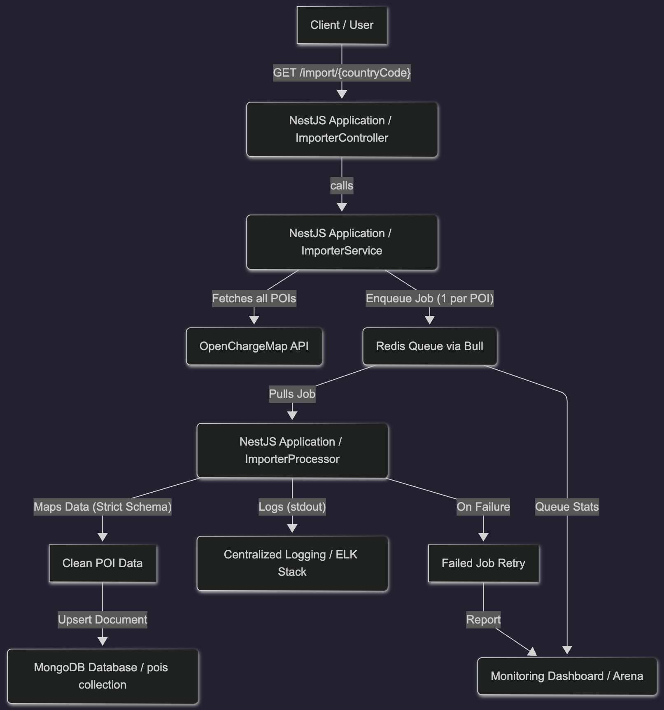

## 📝 `docs/architecture.md` (Architecture, Reliability, and Scalability)

### 1. Project Architecture Overview: The Queue-Based Worker

The JUCR POI Service is built as a dedicated, **headless microservice** using **NestJS** and a **queue-based worker model**. The primary architectural goal is to enable the massive, long-running data ingestion task to be performed **reliably, without blocking the main application thread, and without suffering from HTTP timeouts.**

This separation of concerns is achieved by fully decoupling the synchronous API request flow from the asynchronous data persistence operations using **Redis (Bull)**.

### 2. Architecture Diagram and Data Flow

The data import process is a multi-step, asynchronous flow designed for resilience.

| Step | Component | Action |
| :--- | :--- | :--- |
| **1. Trigger** | Client/User | Sends a `GET /import/{countryCode}` request to initiate the process. |
| **2. Controller** | `ImporterController` | Receives the request and delegates the job to the service layer. |
| **3. API Fetch** | `ImporterService` | Executes a single, optimized request to the **OpenChargeMap API** to retrieve all relevant POI data (up to 50,000+ records). |
| **4. Enqueue Jobs** | `ImporterService` | Iterates over the retrieved list and enqueues **one job per POI object** into the **Redis (Bull) Queue**. |
| **5. HTTP Response** | `ImporterService` | Immediately returns a `202 Accepted` or success response to the client. **Crucially, the request finishes here.** |
| **6. Worker Listen** | `ImporterProcessor` | The worker process (a separate component) listens to and pulls jobs from the Redis Queue. |
| **7. Data Transformation** | `ImporterProcessor` | Maps the raw, external OCM data into the clean, internal `Poi` Mongoose schema. |
| **8. Persistence** | `ImporterProcessor` | Performs an **idempotent `updateOne()`** with `upsert: true` against the **MongoDB Database**. |

### 3. Reliability and Fault Tolerance

Ensuring the integrity and continuous flow of data is paramount. The queue system is the core mechanism for achieving high reliability.

* **Timeout Prevention:** By implementing a worker pattern (Steps 4 & 5), the synchronous HTTP request finishes in milliseconds. This completely eliminates the risk of client or server-side HTTP timeouts, regardless of how long the data persistence (Steps 6-8) takes.
* **Automated Retries:** The **Bull Queue** is configured to automatically handle transient failures. If a job fails due to temporary issues (e.g., brief MongoDB connection loss, network hiccup), the job is automatically moved to a retry state and processed again, ensuring data persistence.
* **Data Integrity (Idempotency):** The persistence logic uses `upsert: true` on the unique `ocmId` index. This makes the import process idempotent, meaning the operation can be safely rerun—whether through an intentional re-trigger or an automatic retry—without creating duplicate records.

### 4. Scalability

The service is designed for effective horizontal scaling to handle future growth in POI data volume.

* **Horizontal Scaling:** The **ImporterProcessor** (the worker component) is completely stateless. It is designed to be deployed in a Kubernetes (K8s) cluster with multiple replicas. Each replica pod can simultaneously consume jobs from the central **Redis Queue**, allowing the data processing throughput to be scaled linearly by simply increasing the pod count.
* **Concurrent API Retrieval:** The service minimizes external API interaction by fetching the maximum possible number of records (e.g., 50,000) in a single request. This high-efficiency retrieval conserves API rate limits and local I/O resources before the asynchronous processing begins.
* **Sharding Readiness:** By employing a UUIDv4 for the primary key (`_id`), the data layer is prepared for future MongoDB sharding (horizontal partitioning), which will be necessary if the database size grows beyond a single replica set's capacity.

---

Bu döküman, teknik değerlendirmenin en önemli gereksinimlerini (Mimari, Güvenilirlik ve Ölçeklenebilirlik) kapsamlı bir şekilde karşılamaktadır.

Şimdi sırada **API ve GraphQL Entegrasyonu**'nu detaylandıran **`docs/api.md`** dosyasını İngilizce olarak hazırlamak var. Devam edelim mi?